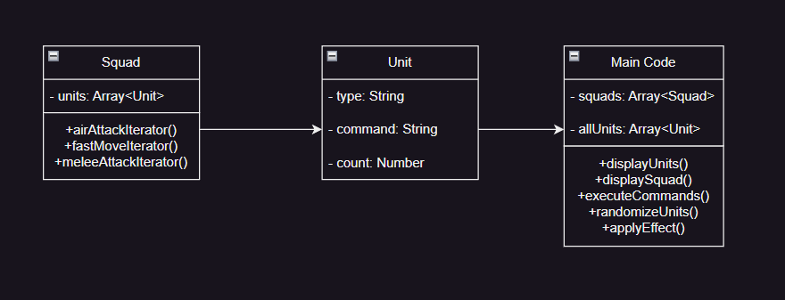
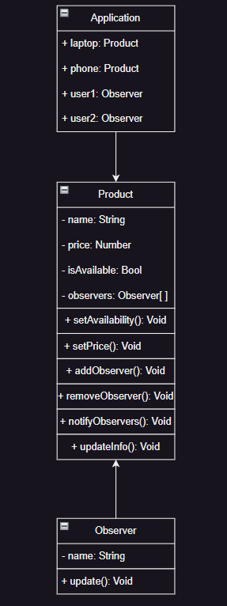
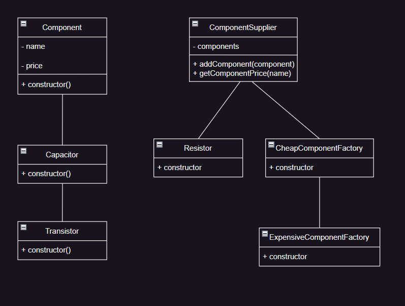
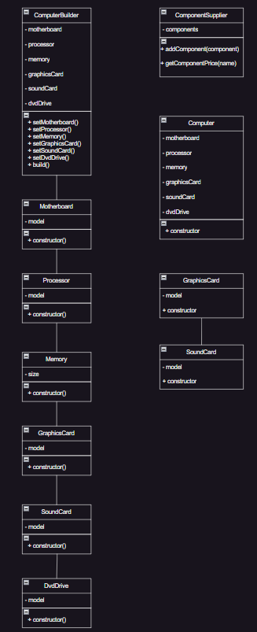
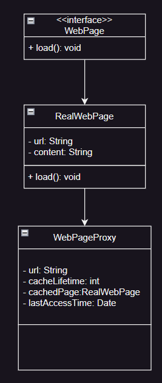
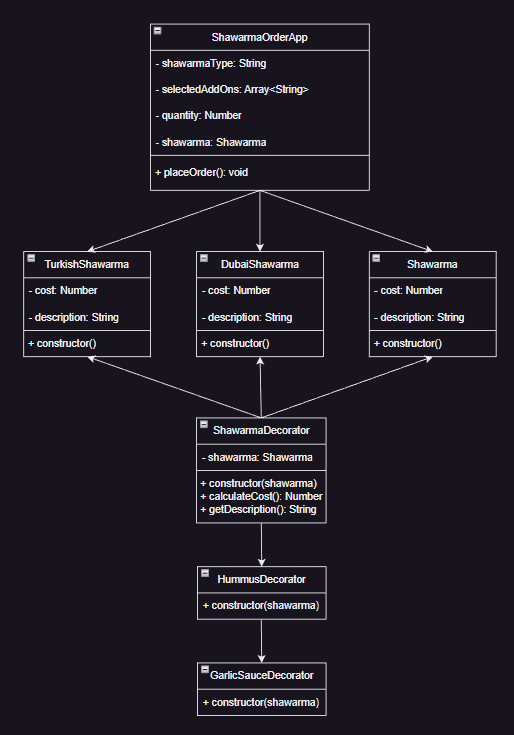

# MIKS

## Iterator

## Observer

## Abstract Factory

## Builder

## Proxy

## Decorator

<table style ='width: 100%;' border="1">
    <tbody>
        <tr>
            <td style='width: 50%;'>Variant </td>
            <td style='width: 50%;'>13 </td>
        </tr>
        <tr>
            <td style='width: 50%;'>IDE </td>
            <td style='width: 50%;'>VSCode </td>
        </tr>
        <tr>
            <td style='width: 50%;'>Language </td>
            <td style='width: 50%;'>JavaScript </td>
        </tr>
        <tr>
            <td style='width: 50%;'>Database </td>
            <td style='width: 50%;'>sql server managеment </td>
        </tr>
    </tbody>
</table>
